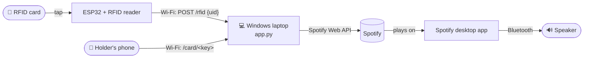
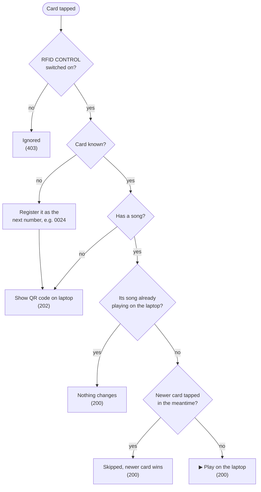
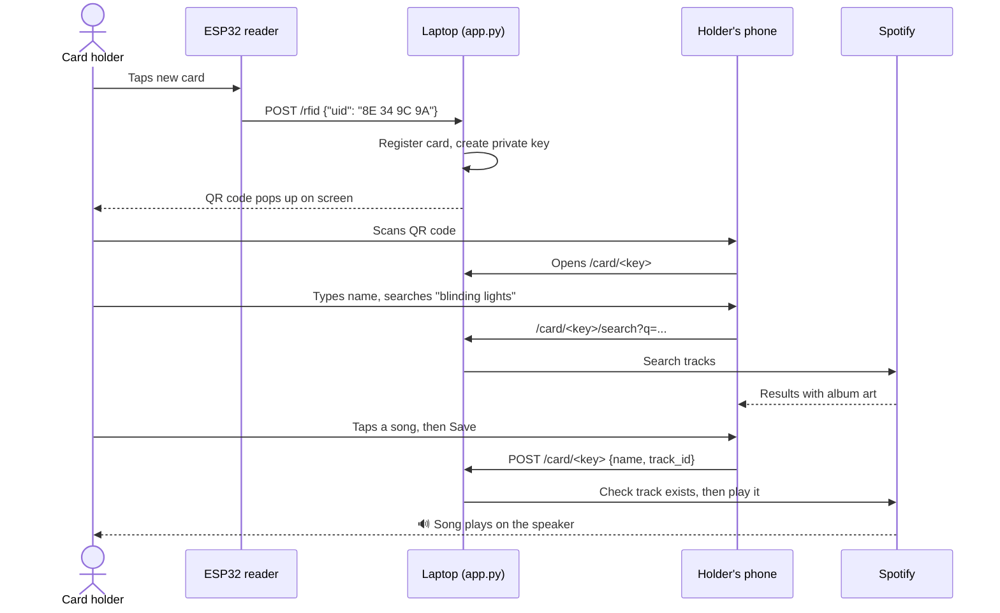

# Tapnotic

**Tap a card, hear your song.**

Tapnotic turns RFID cards into a jukebox. Everyone gets a card, picks their own song from their phone, and from then on tapping that card on the reader plays it on the speaker.



> 📖 New here? Start with the **[User Manual](docs/USER_MANUAL.md)**. It covers setup, daily use and fixing problems, in plain steps.

---

## Features

| | |
|---|---|
| 🎵 **Tap to play** | Each card is linked to one Spotify track, which plays on the laptop's Spotify app |
| 📱 **Self-service cards** | Tapping a new card shows a QR code. The holder scans it, searches Spotify and picks their own song |
| 🔗 **Private card links** | Every card has its own link that the holder can bookmark and use to change their song anytime |
| 🔁 **Smart replays** | Tapping the same card while its song is playing does nothing. After the song ends, it plays again |
| ⚡ **Fast switching** | Remembers the laptop's Spotify device and never plays a blip of the old song |
| 🏁 **Last tap wins** | When several cards are tapped quickly, only the last one plays |
| 🛡️ **Built for Windows** | Survives OneDrive file locks, Wi-Fi drops and Spotify rate limits, and keeps the laptop awake |

---

## How a tap is handled



## How a holder picks their song



---

## Quick start (Windows)

**You need:** Windows with Python 3.9+, the Spotify desktop app signed in to a **Premium** account, the ESP32 reader already flashed, and everything on the same Wi-Fi.

1. **Create a Spotify app** at [developer.spotify.com/dashboard](https://developer.spotify.com/dashboard)
   - Redirect URI: `http://127.0.0.1:5000/callback`
   - APIs: **Web API**
2. **Configure:** copy `.env.example` to `.env` and fill in `SPOTIFY_CLIENT_ID` and `SPOTIFY_CLIENT_SECRET`.
3. **Run:** double-click **`run_app.bat`**. It installs the requirements the first time.
4. Click **Authorize Spotify** once and approve in the browser.
5. Click **Test Devices**. Your laptop should appear as `type=Computer`.
6. Tap a card. 🎉

<details>
<summary>Manual install instead of run_app.bat</summary>

```bat
py -m pip install -r requirements.txt
py app.py
```
</details>

---

## Configuration

All settings live in `.env`, next to `app.py`.

| Setting | Required | What it does |
|---|:---:|---|
| `SPOTIFY_CLIENT_ID` | ✅ | From your Spotify developer app |
| `SPOTIFY_CLIENT_SECRET` | ✅ | From your Spotify developer app. **Never share or commit it** |
| `SPOTIFY_REDIRECT_URI` | | Defaults to `http://127.0.0.1:5000/callback` |
| `SPOTIFY_DEVICE_NAME` | | Exact Spotify device name to play on, if auto-detection picks the wrong one |
| `TAPNOTIC_HOST` | | The laptop's Wi-Fi IP for QR codes, if the detected one is wrong (VPN, Hyper-V, VirtualBox) |

---

## ESP32 contract

The reader sends one request per tap:

```http
POST http://<LAPTOP_IP>:5000/rfid
Content-Type: application/json

{"uid": "9A ED EA 30"}
```

The UID is matched case-insensitively and repeated spaces are collapsed. Keep the bytes **space-separated** (`9A ED EA 30`, not `9AEDEA30`).

| Status | Meaning | Body |
|:---:|---|---|
| `200` | Played, same song still playing, or skipped for a newer tap | `{"ok": true, "changed": true/false, "message": "..."}` |
| `202` | Card has no song yet, so a QR code is shown on the laptop | `{"ok": true, "claim": true, "message": "..."}` |
| `400` | No UID in the request | `{"ok": false, "error": "Missing RFID UID"}` |
| `403` | RFID CONTROL is switched off in the app | `{"ok": false, "error": "RFID control OFF"}` |
| `500` | Spotify couldn't start playback | `{"ok": false, "error": "..."}` |

## Web endpoints

| Method | Path | Used by |
|---|---|---|
| `POST` | `/rfid` | ESP32 reader |
| `GET` | `/card/<key>` | Holder's phone: the song picker page |
| `GET` | `/card/<key>/search?q=` | Song picker: Spotify search |
| `POST` | `/card/<key>` | Song picker: save `{name, track_id}` |
| `GET` | `/callback` | Spotify login redirect |

---

## Project files

```
tapnotic/
├── app.py              # Everything: Flask server + Spotify control + Tk window
├── mappings.json       # Cards: UID → name, song, private key
├── requirements.txt    # Flask, requests, python-dotenv, qrcode
├── run_app.bat         # Windows launcher (installs requirements if missing)
├── .env.example        # Settings template → copy to .env
├── .env                # Your Spotify credentials (git-ignored)
├── spotify_token.json  # Saved Spotify login (git-ignored)
└── docs/
    ├── USER_MANUAL.md  # Step-by-step guide for running and using Tapnotic
    └── images/         # Screenshots used in the manual
```

**`mappings.json` card format:**

```json
"8E 34 9C 9A": {
  "name": "0023 / abhij",
  "spotify": "https://open.spotify.com/track/2p1tAeCLCmJFW2grWsFldK",
  "title": "Song name — Artist",
  "key": "private-link-key"
}
```

---

## Good to know

- **Everything runs on the laptop.** If it's off or asleep, the cards stop working. Tapnotic keeps Windows awake while it's open, but closing the lid can still put it to sleep.
- **Phones must be on the same Wi-Fi** as the laptop to open card pages.
- **Card links are private.** Anyone with a card's link (on your Wi-Fi) can change that card's song, so only share it with the card's holder.
- **Spotify Premium is required.** Spotify only allows playback control on Premium accounts.

Having trouble? See **[Troubleshooting](docs/USER_MANUAL.md#7-troubleshooting)** in the manual.
