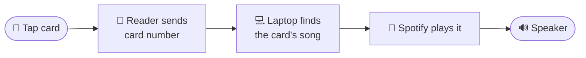
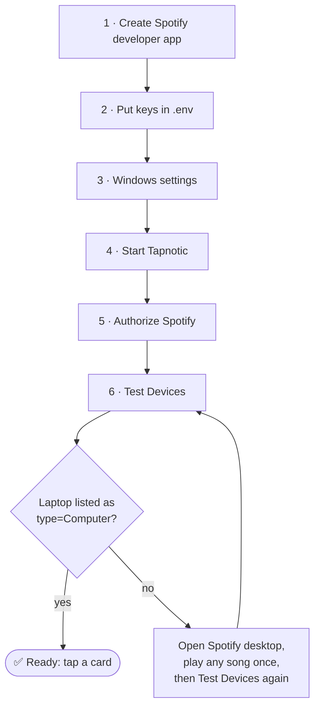
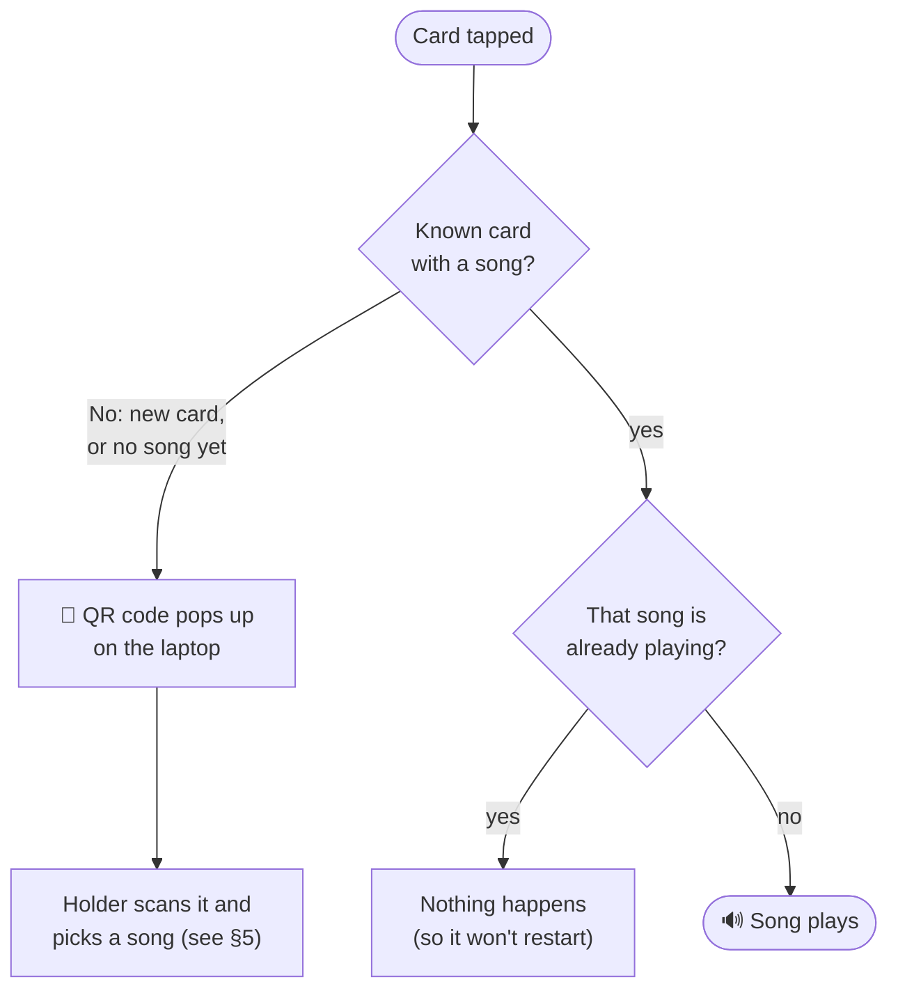
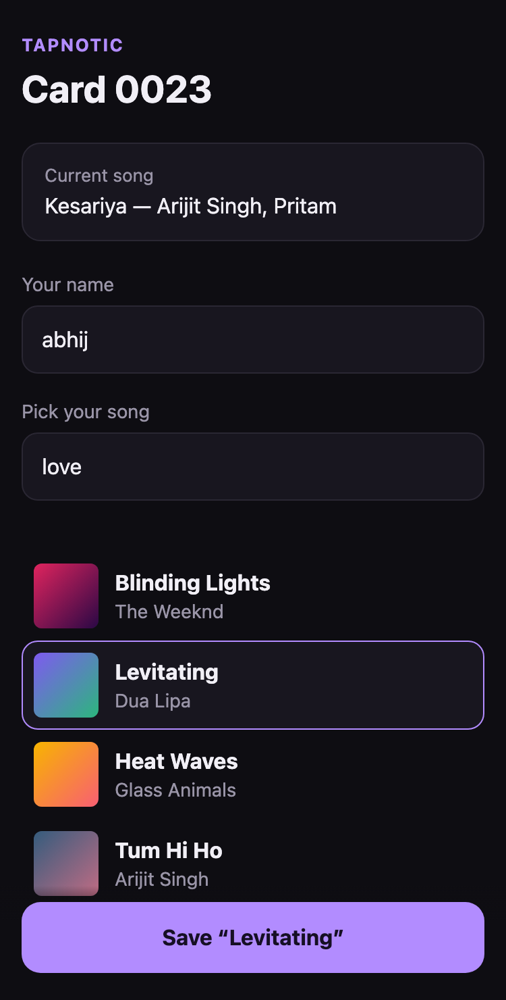
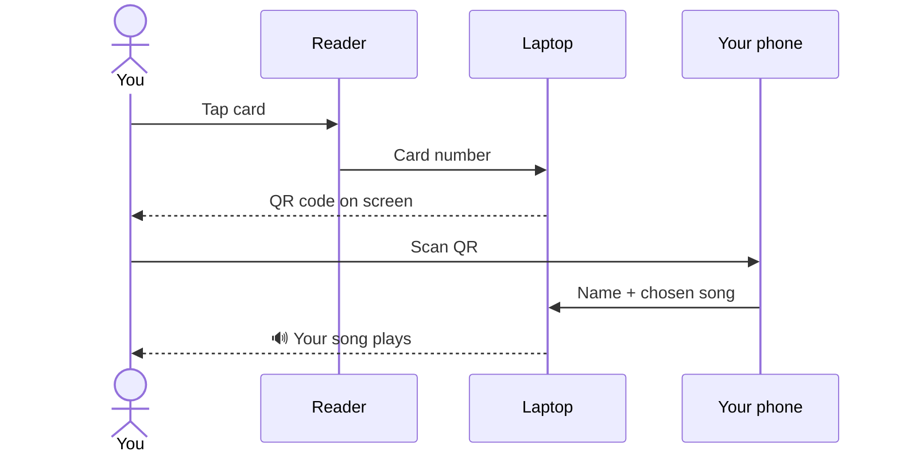
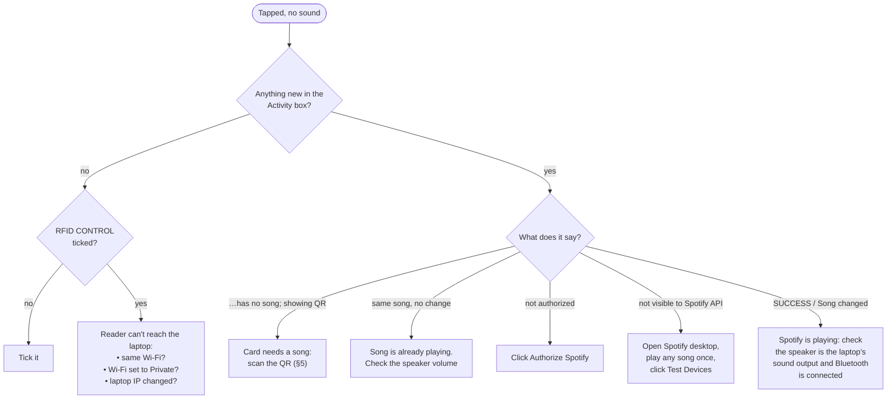

# Tapnotic User Manual

**Tap a card, hear your song.** This guide covers everything from first setup to fixing problems. Jump to the part you need:

| I am… | Go to |
|---|---|
| Setting Tapnotic up for the first time | [2. What you need](#2-what-you-need) → [3. First-time setup](#3-first-time-setup) |
| Running it day to day | [4. Everyday use](#4-everyday-use) |
| Someone who just got a card | [5. For card holders](#5-for-card-holders) |
| Adding or changing cards | [6. Managing cards](#6-managing-cards) |
| Stuck: something isn't working | [7. Troubleshooting](#7-troubleshooting) |

---

## 1. Tapnotic in 30 seconds

Every card is linked to one song. Tap the card on the reader and that song plays on the speaker.



- **New card?** A QR code pops up on the laptop. The holder scans it with their phone and picks their own song.
- **Same card while its song is playing?** Nothing happens, so it won't restart.
- **Song finished?** Tap again and it plays again.

> ⚠️ **The laptop is the brain.** Tapnotic only works while the laptop is on and the Tapnotic window is open.

---

## 2. What you need

- [ ] **Windows laptop** with [Python 3.9+](https://www.python.org/downloads/). When installing, tick **"Add python.exe to PATH"**
- [ ] **Spotify desktop app**, signed in with a **Spotify Premium** account
- [ ] **Bluetooth speaker**, paired to the laptop and set as its sound output
- [ ] **ESP32 RFID reader**, flashed and powered
- [ ] **RFID cards**
- [ ] **One Wi-Fi network** that the laptop, the reader and everyone's phones are all on

---

## 3. First-time setup

About 15 minutes, done once.



### Step 1: Create a Spotify developer app

Tapnotic needs its own "key" to control Spotify.

1. Go to **[developer.spotify.com/dashboard](https://developer.spotify.com/dashboard)** and log in.
2. Click **Create app** and fill in:
   - **App name:** `Tapnotic`
   - **Redirect URI:** `http://127.0.0.1:5000/callback` (copy it exactly)
   - **APIs used:** tick **Web API**
3. Save, then open the app's **Settings** and copy the **Client ID** and **Client Secret**.

> 💡 If the Spotify account that plays the music is *different* from the one that created the app, add that account under **User Management** in the app settings.

### Step 2: Put the keys in `.env`

1. In the Tapnotic folder, copy **`.env.example`** and rename the copy to **`.env`**.
2. Open it in Notepad and paste your keys:
   ```ini
   SPOTIFY_CLIENT_ID=paste_client_id_here
   SPOTIFY_CLIENT_SECRET=paste_client_secret_here
   SPOTIFY_REDIRECT_URI=http://127.0.0.1:5000/callback
   ```
3. Save.

> 🔒 **Never share `.env`.** The client secret is like a password.

### Step 3: Windows settings

These stop the most common problems before they happen.

| Setting | Where | Why |
|---|---|---|
| **Wi-Fi = Private network** | Settings → Network & internet → Wi-Fi → *your network* → **Private** | On "Public", Windows blocks the reader and phones |
| **Allow Python through the firewall** | Click **Allow** on the popup the first time Tapnotic starts | Same reason |
| **Lid close = Do nothing** | Control Panel → Power Options → *Choose what closing the lid does* → **Do nothing** (plugged in) | A sleeping laptop can't hear taps |
| **Folder outside OneDrive** | Keep it at e.g. `C:\tapnotic`, not on the Desktop | OneDrive can briefly lock files |
| **Fixed IP for the laptop** | Your router's admin page → *DHCP reservation* | Keeps the reader's address and card links working |

### Step 4: Start Tapnotic

Double-click **`run_app.bat`**.
- The first time, it installs what it needs, which takes about a minute.
- The Tapnotic window opens. The **Activity** box at the bottom shows the laptop's address, e.g. `RFID endpoint: http://192.168.1.20:5000/rfid`. **The ESP32 must send taps to this address.**

### Step 5: Authorize Spotify (once)

Click **Authorize Spotify**. A browser tab opens, you click **Agree**, and it says *"Spotify connected."* Close the tab. Tapnotic remembers the login from now on.

### Step 6: Test Devices

Click **Test Devices**. The Activity box lists what Spotify can see, for example:

```
DEVICE: MY-LAPTOP | type=Computer | active=True | restricted=False
Selected: MY-LAPTOP
```

If you see your laptop, **you're done.** 🎉

---

## 4. Everyday use

### Starting and stopping

| To… | Do this |
|---|---|
| **Start** | Open Spotify desktop, then double-click `run_app.bat` |
| **Stop** | Close the Tapnotic window |
| **Pause taps** (e.g. during a call) | Untick **RFID CONTROL** at the top right |

### The Tapnotic window

```
┌──────────────────────────────────────────────────────────────────────┐
│  RFID -> Spotify                                     ☑ RFID CONTROL  │
│ [Authorize Spotify] [Open Spotify] [Test Devices] [Test Selected]    │
│ [Show QR] [+ Add Card] [Edit] [Delete]                               │
├──────────────┬──────────────────┬────────────────────────────────────┤
│ UID          │ Name             │ Spotify URL                        │
│ 5F 4D 90 2F  │ 0014 / ujwal     │ UNASSIGNED                         │
│ 8E 34 9C 9A  │ 0023 / abhij     │ https://open.spotify.com/track/... │
├──────────────┴──────────────────┴────────────────────────────────────┤
│ Activity                                                             │
│ 20:14:02  RFID 8E 34 9C 9A -> 0023 / abhij -> MY-LAPTOP              │
└──────────────────────────────────────────────────────────────────────┘
```

| Button | What it does |
|---|---|
| **Authorize Spotify** | Connects Tapnotic to your Spotify account (needed once) |
| **Open Spotify** | Starts the Spotify desktop app |
| **Test Devices** | Lists the devices Spotify can see and which one Tapnotic will use |
| **Test Selected** | Plays the selected card's song, as if it had been tapped |
| **Show QR** | Shows the selected card's QR code so its holder can pick or change their song |
| **+ Add Card** | Adds a card by typing its UID by hand (tapping a new card is easier, see §6) |
| **Edit** | Changes a card's name or Spotify link by hand |
| **Delete** | Removes a card |
| **☑ RFID CONTROL** | Unticked means taps are ignored |

### What happens when a card is tapped



Tapping several cards quickly? **The last one wins.**

---

## 5. For card holders

*Share this section with anyone who gets a card.*

### Pick your song in 4 steps



1. **Tap your card** on the reader. A QR code appears on the laptop screen.
2. **Scan the QR code** with your phone camera. Your phone must be on the **same Wi-Fi**.
3. **Type your name**, then **search** for your song and tap it.
4. Press **Save**. Your song plays on the speaker right away. 🎉

From now on, tapping your card plays your song.

<br clear="right">

### Change your song later

**Bookmark the page** after you save. Open the bookmark anytime to pick a different song.

Lost the link? Ask whoever runs the laptop to select your card and press **Show QR**.

> 🔒 **Your link is private.** Anyone who has it can change your card's song, so don't share it.



---

## 6. Managing cards

### Add a new card (the easy way)

Just **tap it**. Tapnotic registers it automatically with the next free number (e.g. `0024`) and shows its QR code. Hand the card and QR to its holder.

### Give an existing card holder their link

Cards set up before the song picker existed still work. To give their holders a link:
1. Select the card in the list.
2. Click **Show QR**.
3. The holder scans it and bookmarks the page.

### Other card jobs

| Task | How |
|---|---|
| Change a card's song yourself | Select it → **Edit** → paste a Spotify track link (`https://open.spotify.com/track/...`) |
| Rename a card | Select it → **Edit** → change the name (keep the number, e.g. `0012 / di`) |
| Remove a card | Select it → **Delete** |
| Check a card works | Select it → **Test Selected** |
| Back up all cards | Copy `mappings.json` somewhere safe |

> 💡 **Getting a Spotify track link:** in Spotify, right-click a song → **Share** → **Copy Song Link**.

---

## 7. Troubleshooting

### "I tapped a card and nothing played"



### Activity messages explained

| Message in the Activity box | Meaning | Fix |
|---|---|---|
| `RFID ... -> ... -> MY-LAPTOP` / `SUCCESS` | ✅ It played | — |
| `same song, no change` | Its song is already playing | — |
| `has no song; showing QR` | The card needs a song | Scan the QR (§5) |
| `New card ... registered as 0024` | A new card was added | Scan the QR (§5) |
| `Skipping track ...; a newer card was scanned` | Another card was tapped right after | — |
| `Spotify is not authorized` | Tapnotic lost its Spotify login | Click **Authorize Spotify** |
| `Spotify token refresh rejected` | The saved login expired | Click **Authorize Spotify** |
| `not visible to Spotify API` | Spotify can't see the laptop | Open Spotify desktop, play any song once, then **Test Devices** |
| `Spotify rate limit; retrying` | Too many requests; it retries automatically | Wait a moment |
| `Spotify network error` | The internet dropped | Check Wi-Fi |
| `WARNING: no Wi-Fi address found` | The laptop isn't on a network | Connect to Wi-Fi and restart Tapnotic |
| `WARNING: mappings.json could not be read` | The card file was damaged, so defaults were loaded | Your old file was kept as `mappings.broken-<date>.json`. Fix it or copy cards back from it |

### Other problems

| Problem | Fix |
|---|---|
| **"Port 5000 is already in use"** when starting | Tapnotic is already open (check the taskbar), or another app uses port 5000. Close it and try again |
| **Phone can't open the QR link** | Phone must be on the same Wi-Fi (not mobile data), and the laptop's Wi-Fi must be set to **Private** |
| **QR link shows a strange IP** (e.g. from a VPN) | Turn off the VPN, or add `TAPNOTIC_HOST=<laptop's Wi-Fi IP>` to `.env` and restart |
| **Bookmarked card link stopped working** | The laptop's IP changed. Ask for **Show QR** again, and set a fixed IP on the router (§3) |
| **Music plays on the laptop speakers, not Bluetooth** | Windows sound settings → Output → choose the Bluetooth speaker |
| **Music plays on the wrong device** | Add `SPOTIFY_DEVICE_NAME=<your laptop's name from Test Devices>` to `.env` |
| **`run_app.bat` says it can't install requirements** | Check the internet connection, and that Python is installed from python.org with "Add to PATH" ticked |
| **Cards stop working after a while** | The laptop went to sleep. Set lid close to *Do nothing* (§3) |

---

## 8. FAQ

**Does it work without the laptop?**
No. The laptop runs Tapnotic and plays the music. A Raspberry Pi could replace it later.

**Do card holders need Spotify?**
No. They only pick a song on the web page. The music plays from the laptop's Spotify account.

**Does it need Spotify Premium?**
Yes. Spotify only allows remote playback control on Premium.

**Can two cards have the same song?**
Yes.

**Can a card play a playlist or album?**
Not yet. Tracks only.

**Where are the cards stored?**
In `mappings.json` in the Tapnotic folder. Copy it to back up your cards.
